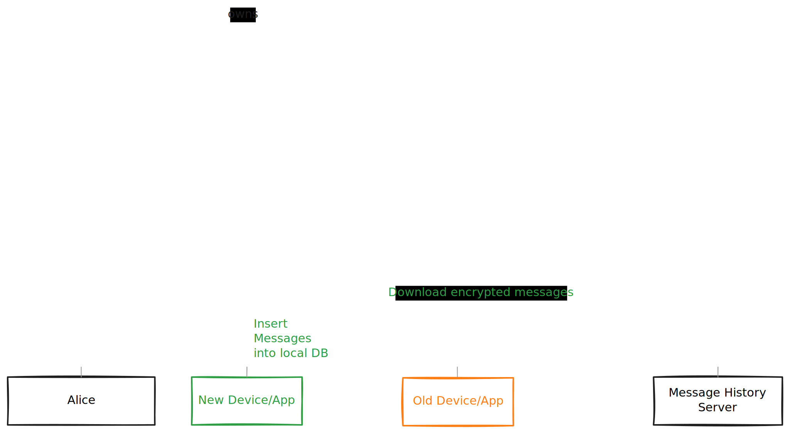

# XMTP Message History Server

A simple, asynchronous file server provided as an example to support XMTP Message History transfers. 

Running this server allows XMTP service providers to provide the ability for users to securely upload message history bundles via a `POST` request and retrieve them via a `GET` request from another authorized app or device, using a unique ID assigned upon upload.   
It is expected that these uploaded bundles should be: encrypted, short-lived, non-guessable, with scoped access to only authorized parties.

## Getting Started

### Prerequisites

Ensure you have the following installed:

- Rust and Cargo. You can install them both from [https://rustup.rs](https://rustup.rs)
- To run the scripts in the [`examples/`](./examples/) folder, ensure python is correctly installed on your system.

### Installing

Clone the repository to your local machine:

    git clone https://github.com/xmtp/xmtp-message-history-server.git
    cd xmtp-message-history-server

Build the project:

    cargo build

Run the server:

    cargo run

The server will start running on http://0.0.0.0:5558.

## Usage

Set the `AES_KEY` and `SIGNING_KEY` environment variables.

    export AES_KEY=only-authorized-installations-should-share-this-key
    export SIGNING_KEY=used-to-sign-the-message-bundle

### Uploading a File

To upload a file, send a POST request to http://0.0.0.0:5558/upload with the file data in the request body.  

The server will return a unique ID for the uploaded file.

Example using curl:

    curl -X POST http://0.0.0.0:5558/upload
    -F "file=@path/to/your/message_bundle.aes"

### Retrieving a File

To retrieve an uploaded file, you must possess the `HMAC_SIGNATURE` and `SIGNING_KEY` of the message_bundle.

The request must include 

- an `X-HMAC` header using `SHA256` as the hashing algorithm.
- an `X-SIGNING-KEY` header set to the `SIGNING_KEY`

Send a GET request to http://0.0.0.0:5558/files/{id}, where {id} is the unique ID returned by the server during the upload.

Example using curl:

    curl http://0.0.0.0:5558/files/{id} 
    -H "X-HMAC: <HMAC_VALUE_OF_FILE_SIGNED_WITH_SIGNING_KEY>"
    -H "X-SIGNING-KEY: <KEY_THAT_SIGNED_THE_BUNDLE>" 
    --output retrieved_file.aes

### Decrypting a File

To decrypt the downloaded file, you must possess the `AES_KEY` that was used to encrypt the message_bundle.

### Example Reference Client  

An example set of python scripts are available in the `examples/` folder demonstrating the full roundtrip of:
- encrypting, signing, uploading in `upload-bundle.py`
- authenticating (using the hmac key), downloading, and decrypting in `fetch-bundle.py` 

Set up a virtual environment

    python3 -m venv myenv
    source myenv/bin/activate

Install the dependencies

    pip3 install -r requirements.txt

Run the uploader script

    python3 upload-bundle.py

Fetch the uploaded file 

    # export BUNDLE_ID=<bundle-id-from-upload-bundle-response>
    # export HMAC_VALUE=<hmac-value-from-upload-bundle-response>
    python3 fetch-bundle.py

## Contributing

Contributions are welcome! Please feel free to submit a pull request or open an issue.

## License

This project is licensed under the MIT License - see the LICENSE file for details.
